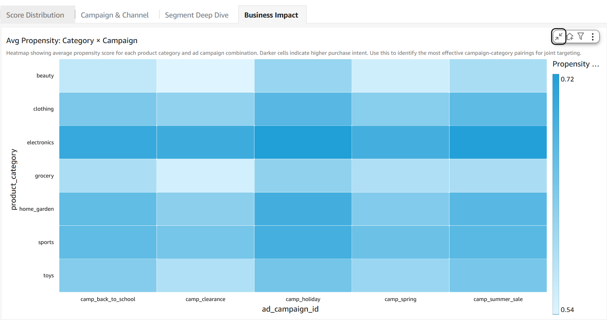
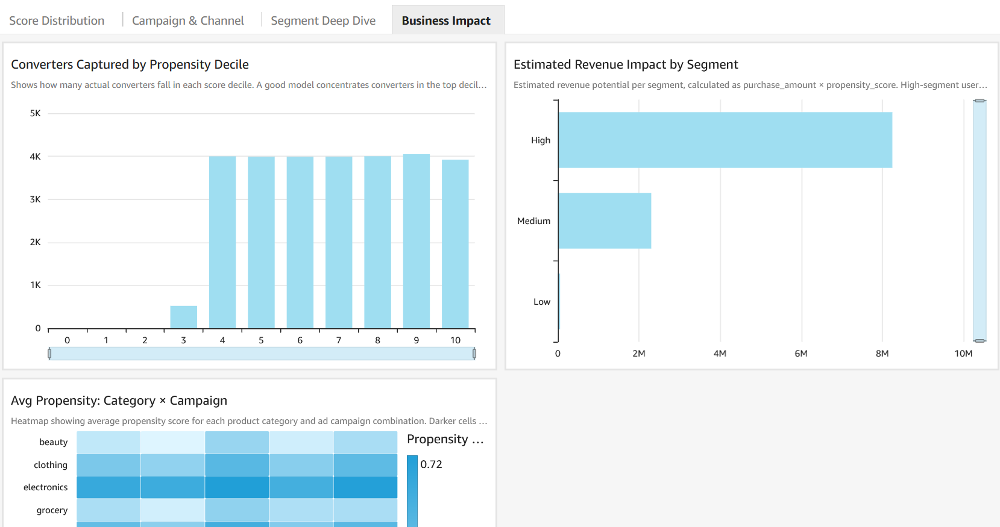
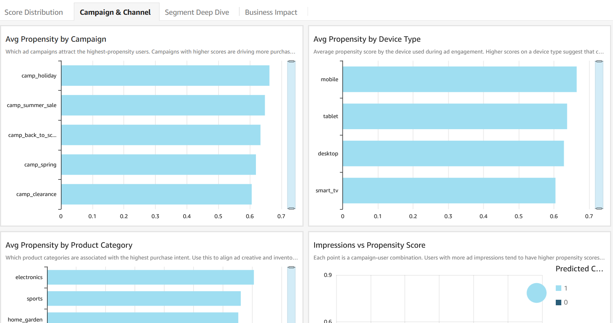
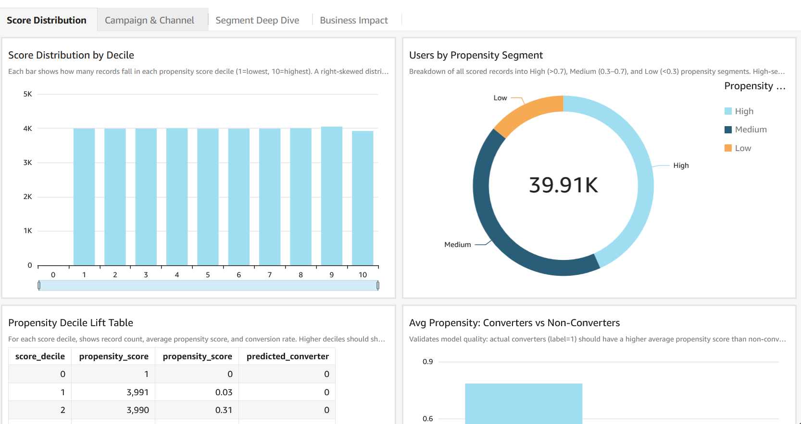
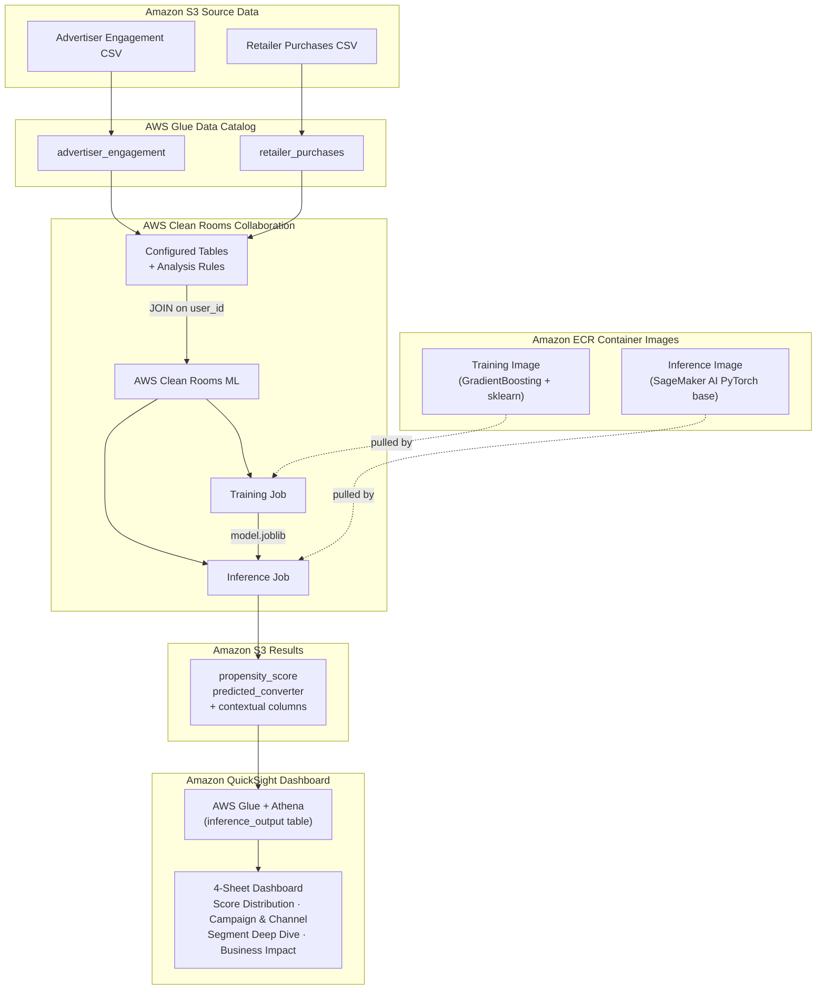

# Predict Purchase Intent from Advertiser Ad Engagement data and Retailer Purchase Data using AWS Clean Rooms ML

[](https://opensource.org/licenses/MIT-0)

Self-contained, reusable, and customizable demo showing how an **advertiser** and a **retailer** can jointly predict which customers are most likely to make a purchase — without either party ever sharing their raw data with the other.

The advertiser contributes **ad engagement data** (impressions, clicks, time spent, device type, campaign) and the retailer contributes **purchase behavior data** (product categories, purchase amounts, site visits, conversion history). AWS Clean Rooms ML joins these datasets inside a secure collaboration, trains a propensity model on the combined signal, and scores every customer — all without exposing either party's underlying records.

The output is a ranked list of customers by purchase propensity, visualized in an Amazon QuickSight dashboard that shows which campaigns, categories, and segments drive the highest conversion intent.

This repo is a sample, to quickly get started with AWS Clean Rooms Custom ML models analysis; it's not meant for production usage AS-IS.

---

## Table of Contents

- [Use Case: Customer Propensity Scoring](#use-case-customer-propensity-scoring)
- [End-to-End Setup Guide](#end-to-end-setup-guide)
- [Optional: Local Testing](#optional-local-testing)
- [Optional: Amazon SageMaker AI Direct Training](#optional-amazon-sagemaker-ai-direct-training)
- [Architecture Diagram](#architecture-diagram)
- [Architecture Notes](#architecture-notes)
- [Data Overview](#data-overview)
- [Feature Engineering](#feature-engineering)
- [Analysis & Model Training](#analysis--model-training)
- [Results](#results)
- [Project Structure](#project-structure)
- [Security Considerations](#security-considerations)
- [Data Classification](#data-classification)
- [Bias and Fairness Considerations](#bias-and-fairness-considerations)
- [Data Governance](#data-governance)
- [Undeploy Resources](#undeploy-resources)
- [License](#license)

---

## Use Case: Customer Propensity Scoring

An **advertiser** knows which users engaged with their ads — but not whether those users actually bought anything. A **retailer** knows which users purchased — but not which ads influenced them. Neither party is willing to share their raw customer data with the other.

By combining both datasets inside an AWS Clean Rooms collaboration, the model learns from the full picture: ad engagement signals from the advertiser and purchase behavior signals from the retailer. The result is a propensity score for every customer that neither party could have produced alone.

**What the advertiser gains:** a ranked list of users to prioritise for ad targeting, based on actual purchase signals — not just clicks.

**What the retailer gains:** insight into which ad-exposed customers are most likely to buy, enabling smarter inventory planning and personalised offers.

**What neither party gives up:** their raw customer data. AWS Clean Rooms enforces that the join happens inside the secure collaboration — no raw records cross the boundary.

---

## End-to-End Setup Guide

### Approximate Timing

| Step | Description | Time |
|------|-------------|------|
| 1 | Generate Synthetic Data | ~2s |
| 2 | Upload Data to S3 | ~11s |
| 3 | Build & Push Containers (CodeBuild) | ~7 min |
| 4 | Setup Clean Rooms Infrastructure | ~31s |
| 5 | Train Model & Run Inference | ~34 min |
| 6 | Create QuickSight Dashboard | ~3 min |
| **Total** | **End-to-end** | **~42 min** |

### Prerequisites

- Python 3.10+ with `boto3`, `pandas`, `scikit-learn`, `joblib` installed
- AWS CLI configured with valid credentials
- AWS account with AWS Clean Rooms ML access enabled

> **Optional — QuickSight Dashboard (Step 6):** If you plan to run `scripts/create_dashboard.py`, your `AWS_REGION` must be a region where Amazon QuickSight is available. QuickSight, Athena, Glue, and S3 must all be in the same region — cross-region Athena connections are not supported by QuickSight. Supported regions include `us-east-1`, `us-east-2`, `us-west-2`, `eu-west-1`, `eu-west-2`, `eu-west-3`, `eu-central-1`, `eu-north-1`, `ap-northeast-1`, `ap-northeast-2`, `ap-southeast-1`, `ap-southeast-2`, `ap-south-1`, `ca-central-1`, and others. See the [full list](https://docs.aws.amazon.com/quicksight/latest/user/regions-qs.html). Also set `QS_NOTIFICATION_EMAIL` in `config.py` to a valid email address — this is used for QuickSight account registration and is validated at script startup.

### Step 0: Configure Your Account

Edit `config.py` and set your values:

```python
AWS_ACCOUNT_ID        = "123456789012"        # Your 12-digit AWS account ID
AWS_REGION            = "eu-north-1"           # Your preferred region
QS_NOTIFICATION_EMAIL = "your@email.com"       # Optional: only needed for Step 6 (QuickSight)
```

All scripts read from this single file — no other hardcoded values to change.

A unique run ID is auto-generated on first script execution and saved to `.run_id`. This suffix is appended to bucket names (e.g. `cleanrooms-ml-demo-123456789012-202603141530`) to avoid collisions with previous runs. Delete `.run_id` to start a fresh run with new buckets.

### Step 1: Generate Synthetic Data

**Script:** `data/generate_synthetic_data.py`

```bash
python data/generate_synthetic_data.py
```

- Generates two synthetic CSV datasets simulating an advertiser/retailer collaboration
- Advertiser engagement data (~18K rows): ad impressions, clicks, time spent, device type
- Retailer purchase data (~22.5K rows): purchase amounts, counts, site visits, conversion flag
- 10,000 users total with 80% overlap between datasets
- Embeds a latent propensity signal so the ML model has something real to learn

**Output artifacts:** `data/advertiser_engagement.csv`, `data/retailer_purchases.csv`

### Step 2: Upload Data to S3

**Script:** `scripts/upload_data.py`

```bash
python scripts/upload_data.py
```

- Creates the source S3 bucket: `cleanrooms-ml-demo-<ACCOUNT_ID>`
- Creates the output S3 bucket: `cleanrooms-ml-output-<ACCOUNT_ID>` (must be separate from source — AWS Clean Rooms doesn't allow query results in the same bucket as source data)
- Uploads both CSVs with appropriate prefixes (`advertiser/`, `retailer/`, `data/`)

**Key resources created:** Two S3 buckets with uploaded data

### Step 3: Build & Push Docker Containers

**Scripts:** `scripts/codebuild_containers.py` + `buildspec.yml` (or `scripts/build_and_push.py` for local Docker)

**Option A — via CodeBuild (no local Docker needed):**
```bash
python scripts/codebuild_containers.py
```

**Option B — via local Docker:**
```bash
python scripts/build_and_push.py
```

- Creates ECR repositories for training and inference images
- **Training container** (`containers/training/`): Amazon SageMaker AI PyTorch training base image with sklearn, pandas, numpy, joblib
- **Inference container** (`containers/inference/`): Amazon SageMaker AI PyTorch inference base image (`pytorch-inference:2.3.0-cpu-py311-ubuntu20.04-sagemaker`) — this specific base image is required by AWS Clean Rooms ML
- Both images are pushed to ECR in your configured region
- The `buildspec.yml` defines the multi-container build and passes `ACCOUNT_ID`, `REGION`, and `SAGEMAKER_REGISTRY` as build-time variables
- Dockerfiles use `ARG` to parameterize the base image registry URL

**Output artifacts:** ECR repositories with training and inference container images

### Step 4: Set Up AWS Clean Rooms Infrastructure

**Script:** `scripts/setup_cleanrooms.py`

```bash
python scripts/setup_cleanrooms.py
```

This creates the full AWS Clean Rooms collaboration infrastructure:

1. **AWS Glue Data Catalog** — database + tables for advertiser and retailer data pointing to S3
2. **IAM Roles:**
   - `data-provider-role` — allows AWS Clean Rooms to read AWS Glue catalog and S3 data
   - `model-provider-role` — allows AWS Clean Rooms ML to pull ECR container images
   - `ml-config-role` — allows AWS Clean Rooms ML to write metrics, logs, and S3 output (needs access to both buckets + Amazon CloudWatch)
   - `query-runner-role` — allows AWS Clean Rooms ML to execute protected queries
3. **Collaboration** — with ML modeling enabled (training + inference)
4. **Membership** — creator membership with query and ML payment responsibilities
5. **Configured Tables** — for `advertiser_engagement` and `retailer_purchases` with LIST analysis rules and `additionalAnalyses: ALLOWED`
6. **Configured Table Associations** — links tables to the membership
7. **ML Configuration** — sets the output S3 location and ML config role
8. **Configured Model Algorithm** — points to the training and inference ECR images with metric definitions
9. **Model Algorithm Association** — associates the algorithm to the collaboration

**Key resources created:** Collaboration, memberships, configured tables, analysis rules, table associations, ML configuration, model algorithm + association

### Step 5: Train Model & Run Inference

**Script:** `scripts/run_cleanrooms_ml.py`

```bash
python scripts/run_cleanrooms_ml.py
```

This orchestrates the full ML pipeline:

1. **Creates training ML input channel** — runs a protected query that joins advertiser and retailer data on `user_id`
2. **Waits for training channel** to become ACTIVE
3. **Creates inference ML input channel** — same join query for inference data
4. **Waits for inference channel** to become ACTIVE
5. **Creates trained model** — AWS Clean Rooms sends the pre-joined data to the training container, which trains a GradientBoosting classifier
6. **Waits for training** to complete and model to become ACTIVE
7. **Starts inference job** — AWS Clean Rooms sends pre-joined data to the inference container, which outputs propensity scores
8. **Waits for inference** to complete

**Output artifacts:** Trained model (ACTIVE), inference results CSV at `s3://cleanrooms-ml-output-<ACCOUNT_ID>/cleanrooms-ml-output/`

### Step 6: Create QuickSight Dashboard

**Script:** `scripts/create_dashboard.py`

```bash
python scripts/create_dashboard.py
```

This creates a fully automated Amazon QuickSight dashboard on top of the inference output. The script is idempotent — safe to re-run, it will update existing resources in place.

What it does:
1. Registers the inference output CSV as an AWS Glue table so Athena can query it
2. Creates an Athena data source in QuickSight
3. Creates a QuickSight dataset with derived fields (`propensity_segment`, `score_decile`, `revenue_impact`)
4. Creates and publishes a 4-sheet dashboard:
   - **Score Distribution** — histogram by decile, segment donut, lift table, converters vs non-converters
   - **Campaign & Channel** — avg propensity by campaign, device type, product category, scatter plot
   - **Segment Deep Dive** — segment summary table, top-scoring records, conversion rate cross-tab
   - **Business Impact** — converters captured by decile, revenue impact by segment, category × campaign heatmap

**Output:** Dashboard URL printed at the end, e.g.:
```
https://eu-west-2.quicksight.aws.amazon.com/sn/dashboards/cleanrooms-ml-demo-propensity-dashboard
```

#### Dashboard Screenshots

**Score Distribution**


**Campaign & Channel**


**Business Impact**




> **Note:** To download the raw inference output from S3 instead:
> ```bash
> aws s3 cp s3://cleanrooms-ml-output-<ACCOUNT_ID>-<RUN_ID>/cleanrooms-ml-output/ ./results/ --recursive --region <REGION>
> ```

---

## Optional: Local Testing

You can test the training pipeline locally without any AWS resources:

```bash
python scripts/test_training_local.py
```

This simulates the SageMaker directory structure locally and runs `train.py` directly.

## Optional: Amazon SageMaker AI Direct Training

To run training via Amazon SageMaker AI directly (outside AWS Clean Rooms):

```bash
python scripts/sagemaker_training_job.py
```

---

## Architecture Diagram



---

## Architecture Notes

- **Source data bucket:** `s3://cleanrooms-ml-demo-<ACCOUNT_ID>-<RUN_ID>` (advertiser + retailer CSVs)
- **Output bucket:** `s3://cleanrooms-ml-output-<ACCOUNT_ID>-<RUN_ID>` (inference results) — must be separate from source
- **IAM roles:** All prefixed with `cleanrooms-ml-demo-` for easy identification
- AWS Clean Rooms joins data on `user_id` and sends headerless CSV to containers (join column excluded)
- Inference container MUST use the Amazon SageMaker AI PyTorch base image — generic Python images cause `AlgorithmError`
- All account-specific values are derived from `config.py` — no hardcoded IDs anywhere

---

## Data Overview

The demo uses two synthetic datasets generated by `data/generate_synthetic_data.py`. The data simulates a realistic scenario with correlated signals between ad engagement and purchase behavior.

### Population

| Metric | Value |
|--------|-------|
| Total unique users | 10,000 |
| Shared users (in both datasets) | 8,000 (80%) |
| Advertiser-only users | 1,000 (10%) |
| Retailer-only users | 1,000 (10%) |
| Date range | Jan 1 – Jun 30, 2025 |

### Party A — Advertiser Engagement Data

**~18,000 rows** — each row represents one user's aggregated engagement with a single ad campaign.

| Column | Type | Description |
|--------|------|-------------|
| user_id | string | Unique user identifier (join key) |
| ad_campaign_id | string | Campaign name (5 campaigns) |
| impressions | int | Number of ad impressions served |
| clicks | int | Number of ad clicks |
| time_spent_seconds | float | Total time spent on ad content |
| device_type | string | Device: mobile, desktop, tablet, smart_tv |
| event_date | date | Date of the engagement record |

Sample rows:

| user_id | campaign | impressions | clicks | time_spent_s | device | date |
|---------|----------|-------------|--------|--------------|--------|------|
| user_000000 | camp_spring | 25 | 1 | 35.2 | smart_tv | 2025-01-22 |
| user_000000 | camp_clearance | 35 | 1 | 7.9 | smart_tv | 2025-01-13 |
| user_000001 | camp_spring | 45 | 3 | 76.4 | desktop | 2025-06-18 |

### Party B — Retailer Purchase Data

**~22,500 rows** — each row represents one user's interaction with a product category.

| Column | Type | Description |
|--------|------|-------------|
| user_id | string | Unique user identifier (join key) |
| product_category | string | Category: electronics, clothing, home_garden, sports, beauty, grocery, toys |
| purchase_amount | float | Total purchase amount in the category |
| purchase_count | int | Number of purchases |
| site_visits | int | Number of site visits |
| days_since_last_purchase | int | Days since most recent purchase |
| last_purchase_date | date | Date of last purchase |
| converted | int | Ground-truth label: 1 = converted, 0 = not |

Sample rows:

| user_id | category | amount | count | visits | days_since | last_date | converted |
|---------|----------|--------|-------|--------|------------|-----------|-----------|
| user_000000 | clothing | 614.13 | 11 | 10 | 140 | 2025-02-10 | 1 |
| user_000000 | toys | 322.67 | 10 | 10 | 8 | 2025-06-22 | 1 |
| user_000001 | clothing | 763.90 | 13 | 11 | 179 | 2025-01-02 | 1 |

### Latent Propensity Model (Data Generation)

The synthetic data embeds a learnable signal: shared users (who appear in both datasets) have a higher base propensity (mean 0.58) compared to non-shared users (mean 0.32). Higher propensity drives:

- Higher click-through rates and more time spent on ads
- More impressions (retargeting effect)
- Higher purchase amounts and counts
- Higher probability of conversion (threshold at 0.50 with noise)

The signal is intentionally noisy: converters and non-converters have overlapping feature distributions (e.g., non-converters can have high purchase counts, converters can have low ones). This overlap produces a realistic spread of continuous propensity scores (0.1–0.9) rather than binary 0/1 predictions.

---

## Feature Engineering

**AWS Clean Rooms Mode:** When AWS Clean Rooms ML runs training, it joins the two tables on `user_id` and sends a single pre-joined, headerless CSV to the training container. The `user_id` column is excluded (it's the join key). The training script detects this format and applies column names automatically.

### Features Used (AWS Clean Rooms Mode)

| Feature | Source | Description |
|---------|--------|-------------|
| impressions | Advertiser | Raw impression count |
| clicks | Advertiser | Raw click count |
| time_spent_seconds | Advertiser | Total time on ad content |
| click_through_rate | Derived | clicks / impressions (computed in training) |
| time_per_click | Derived | time_spent / clicks (computed in training) |
| purchase_amount | Retailer | Total purchase amount |
| purchase_count | Retailer | Number of purchases |
| site_visits | Retailer | Number of site visits |
| days_since_last_purchase | Retailer | Recency of last purchase |

**Target variable:** `converted` (1 = purchased, 0 = did not purchase)

### Features Used (Local/Amazon SageMaker AI Mode)

When running locally or via Amazon SageMaker AI (two separate CSVs with headers), the training script aggregates per-user before joining. Additional aggregated features include:

- `num_campaigns` — number of distinct campaigns the user engaged with
- `num_devices` — number of distinct device types used
- `avg_impressions`, `avg_clicks` — per-campaign averages
- `num_categories` — number of product categories browsed
- `total_site_visits` — aggregated across categories
- `min_days_since_purchase` — most recent purchase recency

---

## Analysis & Model Training

### Model Architecture

| Parameter | Value |
|-----------|-------|
| Algorithm | Gradient Boosting Classifier (sklearn) |
| Train/Test Split | 80% / 20%, stratified by target |
| n_estimators | 100 |
| max_depth | 5 |
| learning_rate | 0.1 |
| Random seed | 42 |

### Training Flow in AWS Clean Rooms ML

1. AWS Clean Rooms joins advertiser and retailer tables on `user_id` inside the collaboration
2. The pre-joined data (headerless CSV, no `user_id` column) is sent to the training container
3. The training script detects the headerless format and applies column names
4. Derived features (`click_through_rate`, `time_per_click`) are computed
5. GradientBoostingClassifier is trained on the 9 features with `converted` as target
6. Model artifacts (`model.joblib`, `feature_columns.json`) are saved to `/opt/ml/model`
7. Metrics (accuracy, precision, recall, F1, ROC-AUC) are saved to `/opt/ml/output/data`

### Inference Flow in AWS Clean Rooms ML

1. AWS Clean Rooms sends the same pre-joined data to the inference container
2. The inference handler loads the trained model and feature column list
3. Derived features are computed on the fly (same as training)
4. Model predicts `propensity_score` (0–1) and `predicted_converter` (0/1) for each record
5. Results are written as CSV to the configured output S3 bucket

### Container Requirements

- **Training container:** Any Python image with sklearn, pandas, numpy, joblib (we used `python:3.11-slim` as base, wrapped in the Amazon SageMaker AI PyTorch training image)
- **Inference container:** Must use the Amazon SageMaker AI PyTorch inference base image: `pytorch-inference:2.3.0-cpu-py311-ubuntu20.04-sagemaker`. AWS Clean Rooms ML requires this specific base image for inference — using a generic Python image causes `AlgorithmError` failures.

---

## Results

After successful inference, AWS Clean Rooms ML writes the output to the configured S3 bucket. The output contains a propensity score and binary prediction for each record in the pre-joined dataset.

**Output S3 path:** `s3://cleanrooms-ml-output-<ACCOUNT_ID>-<RUN_ID>/cleanrooms-ml-output/`

### Output Format

| Column | Type | Description |
|--------|------|-------------|
| propensity_score | float (0–1) | Predicted probability of conversion |
| predicted_converter | int (0/1) | Binary prediction: 1 = likely converter |
| ad_campaign_id | string | Ad campaign the record belongs to |
| device_type | string | Device type (mobile, desktop, tablet, smart_tv) |
| product_category | string | Product category browsed/purchased |
| purchase_amount | float | Total purchase amount |
| impressions | int | Number of ad impressions |
| clicks | int | Number of ad clicks |

> **Note:** `user_id` is never present in the output — it is the Clean Rooms join key and is excluded from the ML input channel by design. The passthrough contextual columns (`ad_campaign_id`, `device_type`, etc.) come from the pre-joined data already approved for the inference channel and are used to power the QuickSight dashboard segmentation.

Example output rows:

| propensity_score | predicted_converter |
|------------------|---------------------|
| 0.8723 | 1 |
| 0.6241 | 1 |
| 0.3102 | 0 |
| 0.1547 | 0 |
| 0.9201 | 1 |
| 0.4834 | 0 |

### Interpreting the Results

- `propensity_score > 0.5` → predicted as likely converter (`predicted_converter = 1`)
- Higher scores indicate stronger purchase intent based on combined ad + purchase signals
- The advertiser can use these scores to prioritize ad targeting toward high-propensity users
- The retailer can identify which ad-exposed customers are most likely to purchase
- Scores are generated for all ~40,000 records in the pre-joined dataset (one per user-campaign-category combination)

### Key Metrics (from training evaluation)

The model is evaluated on a held-out 20% test set during training. Typical metrics for this synthetic dataset:

| Metric | Approximate Value |
|--------|-------------------|
| Accuracy | ~78–82% |
| Precision | ~78–82% |
| Recall | ~80–85% |
| F1 Score | ~80–84% |
| ROC-AUC | ~0.86–0.90 |

> **Note:** These are approximate ranges for the synthetic data. Actual metrics depend on the random seed and data split. The moderate performance reflects the intentionally noisy signal in the synthetic data — converters and non-converters have overlapping feature distributions, producing a realistic spread of propensity scores rather than binary predictions.

---

## Project Structure

```
config.py                          ← SET YOUR ACCOUNT + REGION HERE
pyproject.toml                    ← Dependency declarations (loose constraints)
uv.lock                           ← Pinned lockfile (exact versions + hashes)
README.md                         ← This file
buildspec.yml                     ← CodeBuild spec (reads env vars from codebuild_containers.py)
data/
  generate_synthetic_data.py      ← Generates synthetic advertiser + retailer CSVs
containers/
  training/
    Dockerfile                    ← Parameterized base image via ARG
    requirements.txt              ← Pinned deps exported from uv.lock
    train.py                      ← GradientBoosting training script
  inference/
    Dockerfile                    ← Parameterized base image via ARG
    requirements.txt              ← Pinned deps exported from uv.lock
    serve.py                      ← HTTP server (/ping + /invocations)
    inference_handler.py          ← Model loading + prediction logic
scripts/
  upload_data.py                  ← Upload CSVs to S3 + create buckets
  codebuild_containers.py         ← Build containers via CodeBuild (no local Docker)
  build_and_push.py               ← Build containers via local Docker
  setup_cleanrooms.py             ← Create Glue, IAM, collaboration, ML config
  run_cleanrooms_ml.py            ← Create channels, train model, run inference
  create_dashboard.py             ← Optional: create QuickSight dashboard (Step 6)
  test_training_local.py          ← Test training locally (no AWS needed)
  sagemaker_training_job.py       ← Optional: run training via SageMaker directly
  update_requirements.sh          ← Regenerate container requirements.txt from lockfile
  undeploy/
    undeploy.py                   ← Delete all demo resources (reverse of setup)
    scan_regions.py               ← Scan regions for leftover demo resources
```

---

## Dependency Management

Container dependencies are pinned via [`uv`](https://docs.astral.sh/uv/) for reproducible, hash-verified builds.

### Adding or Updating a Dependency

1. Edit `pyproject.toml` (loose constraints live here)
2. Run `uv lock` to regenerate `uv.lock` with exact versions + hashes
3. Run `bash scripts/update_requirements.sh` to export pinned deps to both container `requirements.txt` files
4. Commit all three changed files (`pyproject.toml`, `uv.lock`, `containers/*/requirements.txt`)

### Local Development

```bash
uv sync          # creates .venv and installs all deps (including dev group)
```

### CI Checks (CodeBuild)

The build pipeline enforces two guards before building containers:

- **Lockfile freshness** — `uv lock --check` fails if `uv.lock` is out of sync with `pyproject.toml`
- **Requirements drift** — `uv export` output is diffed against the committed `requirements.txt` files; any mismatch fails the build

---

## Security Considerations

This demo implements the following security controls. See [SECURITY.md](SECURITY.md) for the full threat model and review checklist.

- **IAM least-privilege** — All roles use scoped inline policies (no `*FullAccess` managed policies). S3 actions are restricted to specific bucket ARNs and prefixes. AWS Glue actions are scoped to the demo database and tables.
- **S3 hardening** — Block Public Access enabled, SSE-S3 encryption by default, versioning enabled, TLS-only bucket policy (`aws:SecureTransport`).
- **Container input validation** — Inference container enforces a 50 MB payload size limit and validates the input schema. Training container wraps data parsing in error handling.
- **No hardcoded credentials** — `config.py` reads `AWS_ACCOUNT_ID` and `AWS_REGION` from environment variables with fallback defaults.
- **Subprocess safety** — All subprocess calls use `shell=False` with argument lists.
- **Shared Responsibility Model** — AWS is responsible for the security of the cloud infrastructure. You are responsible for configuring IAM, encryption, and access controls in your account. See the [AWS Shared Responsibility Model](https://aws.amazon.com/compliance/shared-responsibility-model/).

## Data Classification

| Property | Value |
|----------|-------|
| Data type | 100% synthetic (algorithmically generated) |
| Contains real PII | No |
| Contains real customer data | No |
| Data sensitivity | Non-sensitive / public-safe |
| Generation method | Python `random` module with seed 42 |
| Source script | `data/generate_synthetic_data.py` |

All `user_id` values (e.g., `user_000000`) are synthetic identifiers with no connection to real individuals. The CSV files can be safely distributed and do not require encryption at rest for compliance purposes, though SSE-S3 is enabled by default as defense-in-depth.

See `data/README.md` for additional data provenance details.

## Bias and Fairness Considerations

This demo uses synthetic data with an intentionally embedded propensity signal for demonstration purposes. The following considerations apply if adapting this approach for production use:

- **Training data bias** — The synthetic data generator assigns higher base propensity to shared users (mean 0.58) vs. non-shared users (mean 0.32). In a real scenario, this correlation structure should be validated against actual population distributions to avoid systematic bias.
- **Feature selection** — The model uses behavioral features (clicks, impressions, purchase amounts) that may correlate with demographic attributes not present in the data. Evaluate whether proxy discrimination could arise from the chosen feature set.
- **Threshold selection** — The default classification threshold of 0.50 may produce different false-positive/false-negative rates across subpopulations. Consider calibrating the threshold based on fairness metrics (e.g., equalized odds, demographic parity) relevant to your use case.
- **Model monitoring** — In production, monitor model predictions over time for drift in score distributions across user segments.
- **Clean Rooms privacy** — AWS Clean Rooms prevents either party from seeing the other's raw data, which limits the ability to audit for bias across the full feature set. Establish governance processes for joint bias review.

## Data Governance

- **Data provenance** — Both datasets are generated by `data/generate_synthetic_data.py` using deterministic random generation (seed 42). No external data sources are used.
- **Data retention** — ML input channels are configured with a 30-day retention period (`retentionInDays=30`). S3 bucket versioning is enabled for audit trail purposes.
- **Data access** — Access to source and output S3 buckets is controlled via scoped IAM policies. Only the designated Clean Rooms roles can read source data or write inference results.
- **Data lineage** — The training pipeline is fully reproducible: synthetic data generation → S3 upload → AWS Glue catalog → AWS Clean Rooms join → container training → inference output.


---

## Undeploy Resources

Two scripts in `scripts/undeploy/` help you find and remove all AWS resources created by this demo.

### Step 1: Scan for Resources Across Regions

If you deployed the demo to multiple regions (or aren't sure which region was used), scan first:

```bash
python scripts/undeploy/scan_regions.py
```

This checks all AWS Clean Rooms-supported regions for active `cleanrooms-ml-demo` collaborations and reports which regions have resources. Example output:

```
  us-east-1: clean
  eu-west-2: FOUND 1 collaboration(s)
    - cleanrooms-ml-demo-collaboration (id=c2fdff62-...)
  eu-north-1: FOUND 1 collaboration(s)
    - cleanrooms-ml-demo-collaboration (id=e1dd3238-...)
```

### Step 2: Undeploy Resources

Run the undeploy script for each region that has resources. Set `AWS_REGION` to target the correct region:

```bash
# Undeploy from the region configured in config.py
python scripts/undeploy/undeploy.py

# Undeploy from a specific region (override config.py)
AWS_REGION=eu-west-2 python scripts/undeploy/undeploy.py
```

The script prompts for confirmation before deleting. Use `--dry-run` to preview what would be deleted without making changes:

```bash
python scripts/undeploy/undeploy.py --dry-run
```

Use `--skip-confirmation` for non-interactive execution (e.g., CI pipelines):

```bash
python scripts/undeploy/undeploy.py --skip-confirmation
```

### What Gets Deleted

The undeploy script removes all resources in reverse dependency order:

1. **Clean Rooms ML** — inference jobs, trained models, ML input channels, algorithm associations, configured model algorithms
2. **Clean Rooms** — ML configuration, table association analysis rules, table associations, configured tables, analysis rules, collaboration
3. **AWS Glue** — tables and database (`cleanrooms_ml_demo`), including dashboard tables (`inference_output`, `model_metrics`, `feature_importance`) if `create_dashboard.py` was run
4. **Lake Formation** — permission grants for the data provider role
5. **Amazon S3** — source and output buckets (empties all objects and versions first, including `dashboard-data/` CSVs)
6. **Amazon ECR** — training and inference container repositories (including all images)
7. **IAM** — all demo roles (`data-provider`, `model-provider`, `ml-config`, `query-runner`, `codebuild`, `sagemaker`)
8. **CodeBuild** — build project and associated CloudWatch log groups
9. **Amazon QuickSight** — dashboard, analysis, SPICE datasets, and Athena data source (if `create_dashboard.py` was run). The QuickSight account subscription itself is **not** deleted as it is account-wide.

> **Note:** IAM roles are global (not region-scoped), so they only need to be deleted once regardless of how many regions were used. The script handles this gracefully — if a role was already deleted by a previous region's undeploy run, it skips it.

---

## Security

See [CONTRIBUTING](CONTRIBUTING.md#security-issue-notifications) for more information.

## License

This library is licensed under the MIT-0 License. See the [LICENSE](LICENSE) file.
